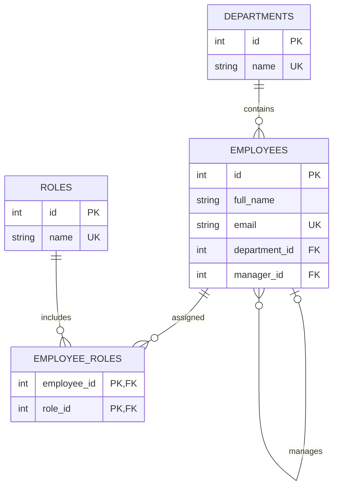

# ER Diagram

```mermaid
erDiagram
    DEPARTMENTS ||--o{ EMPLOYEES : contains
    EMPLOYEES o|--o{ EMPLOYEES : manages
    EMPLOYEES ||--o{ EMPLOYEE_ROLES : assigned
    ROLES ||--o{ EMPLOYEE_ROLES : includes

    DEPARTMENTS {
        int id PK
        string name UK
    }
    EMPLOYEES {
        int id PK
        string full_name
        string email UK
        int department_id FK
        int manager_id FK
    }
    ROLES {
        int id PK
        string name UK
    }
    EMPLOYEE_ROLES {
        int employee_id PK, FK
        int role_id PK, FK
    }
```
